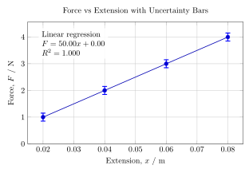
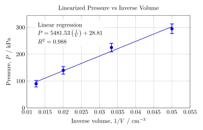

# Physics Internal Assessment (IA) Full Guide

This guide is a complete starting point for writing a Physics Internal Assessment. It includes:

- IA structure
- experimental design guidance
- data analysis methods
- uncertainty calculations
- graphing rules
- sample equations
- example investigations

Markdown headings and LaTeX equations are included intentionally so students can see how scientific writing is structured.

---

## 1. Structure of a Physics IA

Your IA should normally follow this structure.

### Sections

1. Research Question
2. Physics Theory / Model
3. Variables
4. Methodology
5. Raw Data
6. Data Processing
7. Graphs
8. Uncertainty Analysis
9. Discussion
10. Scientific Context
11. Evaluation
12. Conclusion
13. References

---

## 2. Writing a Strong Research Question

A strong research question identifies:

- the independent variable;
- the dependent variable;
- the physical system;
- the measurement method.

This section is extremely important because the research question should align with the entire investigation.

### Alignment Rule

Your research question should match:

- the title of the investigation;
- the data you actually collect;
- the data you process;
- the principal graph used in your analysis.

If these do not match, the IA starts to feel unfocused or inconsistent. A common problem is writing a broad or impressive-sounding question, then collecting data that only answers part of it.

### What this means in practice

If your research question is about how one variable affects another, then:

- your raw data should measure those variables;
- your processed data should be built from those variables;
- your main graph should directly test that relationship.

The reader should be able to look at the research question, then look at the main graph, and immediately see that the graph is answering the question.

### Best Practice

Before starting the experiment, ask:

1. Is this exactly the relationship I am measuring?
2. Will my main graph directly address this question?
3. Does my title describe the same investigation as my research question?

If the answer to any of these is no, revise the research question before collecting more data.

### Example: Hooke's Law

How does the applied force affect the extension of a spring, and does the relationship follow Hooke's Law?

This matches:

- the title of an investigation about force and extension in a spring;
- raw data measuring force and extension;
- a principal graph of Force vs. Extension.

### Example: Boyle's Law

How does the volume of a gas affect its pressure at constant temperature, and does it follow Boyle's Law?

This matches:

- the title of an investigation about gas pressure and volume;
- raw data measuring pressure and volume;
- a principal graph such as $P$ vs. $1/V$ to test the predicted relationship.

---

## 3. Variables

Define variables clearly and explicitly.

Listing the variables is not enough. Students should explain:

- how each variable will be measured;
- which instrument will be used;
- the precision or resolution of that instrument;
- how the independent variable will be varied;
- why some variables must be controlled;
- how those controlled variables will actually be kept constant.

### What this section should include

For each important variable, make sure the reader can answer:

1. What is the variable?
2. How is it measured or set?
3. What instrument is used?
4. What is the uncertainty, resolution, or precision of that instrument?
5. Why does this variable matter in the investigation?

For the independent variable, also explain how you will change it across a useful range.

For controlled variables, explain both:

- why each one must be controlled;
- what you will do in practice to keep it controlled.

### Why this matters

If variables are poorly defined, then:

- the method becomes vague;
- the data may not truly answer the research question;
- the reader cannot judge whether the investigation was fair;
- the analysis becomes harder to trust.

| Type | Variable | Symbol | Unit |
| --- | --- | --- | --- |
| Independent | Force | $F$ | N |
| Dependent | Extension | $x$ | m |
| Controlled | Spring type | --- | constant |
| Controlled | Temperature | --- | constant |

### How to explain variables well

#### Independent variable

Explain how you will vary it.

Example:

- Force will be varied by adding known masses in fixed increments.
- The force will then be calculated using $F = mg$.
- Mass will be measured or identified using calibrated mass pieces.

#### Dependent variable

Explain how it will be measured.

Example:

- Extension will be measured with a ruler fixed next to the spring.
- The ruler resolution is 1 mm, so that measurement precision should be stated in the uncertainty discussion.
- Extension is found by subtracting the natural length from the stretched length.

#### Controlled variables

Do not just list them. Explain why they matter and how they are controlled.

Example:

- **Spring type:** This must be controlled because changing the spring changes the spring constant. The same spring should be used for every trial.
- **Temperature:** This should be controlled because temperature changes can affect material behavior and measurements. Measurements should be taken in the same room under stable conditions.

### Best Practice

A strong variables section should connect directly to the method. If you mention a variable here, the reader should later see exactly how it was measured, varied, or controlled in the procedure.

---

## 4. Physics Model

You must explain the physics behind the experiment, not just describe the procedure.

The theory section should include only the physics that is directly relevant to the investigation. Do not turn it into a textbook chapter or a long background essay. The goal is to introduce the model, definitions, assumptions, and relationships that you will actually use later in the analysis.

### What this section should do

- identify the specific physical principle or model being tested;
- define the main quantities and symbols used in the IA;
- explain the expected relationship between variables;
- state any assumptions or idealizations in the model;
- connect the theory directly to the graph, regression, or calculation you will later perform.

### What this section should not do

- include unrelated theory just to sound advanced;
- copy large chunks of notes or textbook explanations;
- list equations without explaining what they mean;
- introduce formulas that never appear again in the analysis.

### Source and Citation Requirement

Your theory should be grounded in credible sources. If you use a textbook, class notes, a scientific resource, or another academic source to define the model or derive an equation, cite it.

This matters because:

- it shows where the model came from;
- it distinguishes accepted physics from your own explanation;
- it strengthens the scientific credibility of the report.

Good sources include:

- physics textbooks;
- class materials provided by the teacher;
- scientific articles or reputable educational resources;
- manufacturer documentation, if it is directly relevant to the apparatus or method.

Avoid relying on random websites with no clear author, weak scientific oversight, or unclear sourcing.

### Best Practice

Write the theory section as if you are preparing the reader to understand your data processing and conclusion. If a concept is not needed for the analysis, it probably should not be included.

### Example: Hooke's Law

$$F = kx$$

Where:

- $F$ = force (N)
- $k$ = spring constant (N/m)
- $x$ = extension (m)

This model predicts a linear relationship between force and extension, so a graph of $F$ against $x$ should produce a straight line. In this case, the gradient corresponds to the spring constant $k$.

Expected graph:

- Force vs. Extension -> linear relationship

Possible source citation:

- Serway, R. A., and Jewett, J. W. *Physics for Scientists and Engineers*.

### Example: Boyle's Law

$$PV = \text{constant}$$

or

$$P \propto \frac{1}{V}$$

Where:

- $P$ = pressure
- $V$ = volume

This model predicts an inverse relationship between pressure and volume. Because inverse relationships are not linear in their basic form, students should explain why plotting $P$ against $1/V$ is more useful for analysis.

Expected graph:

- $P$ vs. $1/V$ -> linear

Possible source citation:

- Tsokos, K. A. *Physics for the IB Diploma*.

---

## 5. Methodology

Your experiment must be reproducible. Another student should be able to follow your method and obtain a similar data set.

For the IB, methodology is not just a list of steps. It should show that the investigation was designed thoughtfully, that choices were justified, and that the procedure was appropriate for answering the research question.

### IB Expectation

A strong methodology should be:

- clear enough to be repeated by another student;
- justified, not just described;
- appropriate for the physics being investigated;
- detailed enough for the reader to judge whether the data collection was valid;
- consistent with the variables, theory, and analysis later used in the report.

Students should explain not only **what** they did, but also **why** they did it that way.

### What should be included

Include:

- equipment list
- setup diagram
- measurement devices
- resolution of instruments
- step-by-step procedure
- number of trials

### What should be explained and justified

Methodological choices should be justified wherever they affect the quality of the investigation. For example, students should explain:

- why a particular range of values was chosen;
- why the number of trials is sufficient;
- why a given measuring instrument is appropriate;
- why certain controls are necessary;
- why the chosen procedure reduces uncertainty or improves reliability;
- why the setup is suitable for testing the stated research question.

### Repeatability

Repeatability means that another student could read your method, use the same equipment and conditions, and reasonably obtain a comparable data set.

To support repeatability:

- describe the setup clearly;
- state how measurements were taken;
- identify how values were changed between trials;
- specify how many trials or repeats were done;
- explain any steps taken to reduce random error or systematic error.

### Methodological considerations

Any important consideration taken during the design should be made explicit. For example:

- how the apparatus was aligned;
- how zero error was checked;
- how equilibrium was identified before measuring;
- how timing was standardized;
- how environmental conditions were kept stable;
- how the same measurement point or reference point was used each time.

If a decision improved the fairness, precision, or validity of the investigation, it should be mentioned and justified.

### Best Practice

The methodology should read like a scientifically reasoned plan, not a lab handout copied without explanation. If a reader asks, "Why did you do it this way?", the method section should already answer that question.

---

## 6. Raw Data

Raw data must include **every measurement**.

Do not show only averages. The raw data table should preserve exactly what was measured during the experiment.

### What raw data should include

Raw data should be presented in a clear, organized table that includes:

- every trial or measurement taken;
- the measured variables with units;
- the uncertainty of the measuring instrument where relevant;
- consistent decimal places that match the precision of the instrument;
- labels that make it clear what was directly measured and what was not.

### Instrument uncertainty and decimal places

The raw data should reflect the measuring device actually used.

- If a balance reads to `0.01 g`, the recorded masses should match that precision.
- If a ruler is marked to `1 mm`, recorded lengths should reflect that level of precision consistently.
- Decimal places should not be added randomly just to make the table look more scientific.

The reader should be able to look at the table and infer the precision of the instrument from the way the data is recorded.

### Organization

A strong raw data table should be easy to read. That usually means:

- a clear title;
- columns with units in the headings;
- repeated trials shown explicitly;
- uncertainties stated in the heading, caption, or surrounding explanation when appropriate;
- consistent formatting across the full table.

### Observations about the data

Raw data is not only a table. Students should also comment briefly on anything important noticed during data collection.

This may include:

- possible outliers;
- measurements that looked inconsistent;
- difficulties taking a reading;
- fluctuations in the apparatus;
- trends that were already visible during collection;
- anomalies that may need later discussion.

These comments should not become full analysis yet, but they should record what was noticed at the time of measurement.

### Best Practice

Treat the raw data section like a scientific record. It should show exactly what was measured, how precisely it was measured, and whether anything unusual happened during the collection process.

---

## 7. Data Processing

Data processing should show clearly how you moved from raw measurements to the values used in your analysis.

This section needs explanation, not just equations. Students should make it clear:

- what was calculated from the raw data;
- why those calculations were needed;
- which uncertainties apply at each stage;
- how the processed values connect to the graph or final conclusion.

### What belongs in data processing

This section may include:

- averages or means;
- linearized variables;
- transformed variables;
- gradients and intercepts;
- percentage differences;
- uncertainty calculations;
- uncertainty propagation;
- repeated-trial analysis.

The purpose is to show how raw data became processed data in a transparent and scientifically valid way.

### Sample calculations

At least one clear sample calculation should usually be shown for each important type of processing. The reader should be able to follow the logic and reproduce the result.

That means:

- substitute the actual values used;
- show the formula clearly;
- give the numerical result;
- include units where appropriate;
- round in a way that is consistent with the uncertainty.

### Different kinds of uncertainty

Students often combine different uncertainties incorrectly. These should be distinguished clearly.

#### 1. Instrument or machine uncertainty

This comes from the measuring device itself.

Examples:

- a ruler with millimeter markings;
- a balance reading to `0.01 g`;
- a digital sensor with a stated resolution.

This uncertainty applies to the direct measurement and should be recorded based on the instrument used.

#### 2. Spread in repeated values

If you repeat a measurement several times, the values may vary. That variation is different from the machine uncertainty.

The spread tells you how consistent the repeated readings are and helps describe random uncertainty in the data.

### Average

If repeated values were collected, the mean may be calculated as:

$$\bar{x} = \frac{\sum x_i}{n}$$

Where:

- $\bar{x}$ is the mean or average value;
- $x_i$ is one individual measured value;
- $\sum x_i$ means "add all the measured values together";
- $n$ is the total number of repeated measurements.

This is calculated by adding all repeated measurements and dividing by the number of measurements taken.

### Standard deviation

The spread of repeated values may be described using standard deviation:

$$s = \sqrt{\frac{\sum (x_i - \bar{x})^2}{n - 1}}$$

Where:

- $s$ is the standard deviation;
- $x_i$ is one individual measured value;
- $\bar{x}$ is the mean of the repeated values;
- $(x_i - \bar{x})$ is the difference between one value and the mean;
- $\sum (x_i - \bar{x})^2$ means "add the squared differences for all values";
- $n$ is the number of repeated measurements.

This quantity shows how spread out the repeated measurements are around the mean. A small standard deviation means the repeated values were tightly grouped. A larger standard deviation means they were more spread out.

### Uncertainty of the mean

If repeated measurements are averaged, the uncertainty in that average is not the same as the raw machine uncertainty. One way to estimate the uncertainty in the average is:

$$u_{\bar{x}} = \frac{s}{\sqrt{n}}$$

Where:

- $u_{\bar{x}}$ is the uncertainty in the mean;
- $s$ is the standard deviation of the repeated measurements;
- $n$ is the number of repeated measurements.

This is calculated by dividing the standard deviation by the square root of the number of repeats. It estimates how uncertain the average value is, based on the spread of the repeated measurements.

This is only relevant when repeated values were actually taken and averaged.

#### 3. Propagated uncertainty

Propagated uncertainty appears when a new value is calculated from one or more measured quantities.

For example, if a student calculates:

- density from mass and volume;
- resistance from voltage and current;
- force from mass using a formula;

then the uncertainty in the calculated value depends on the uncertainties in the measured inputs.

This is different from:

- the uncertainty of the measuring device itself;
- the spread of repeated measurements;
- the uncertainty in an average.

### Why this distinction matters

A common weakness in IA writing is treating all uncertainty as if it were the same thing. It is not.

Students should explain:

- whether a value is directly measured or calculated;
- whether an uncertainty comes from the instrument, repeated trials, or propagation;
- why a particular uncertainty method is appropriate for that quantity.

### Best Practice

Every processed value should be traceable back to the raw data. The reader should be able to see not only the final number, but how it was obtained and what kind of uncertainty belongs to it.

---

## 8. Uncertainty Analysis

Every measured quantity should include an uncertainty.

### Example

$$L = 0.050 \pm 0.001\ \text{m}$$

### Uncertainty Propagation

Uncertainty propagation is used when a value is calculated from other measured quantities.

This is important because the calculated result inherits uncertainty from the measurements used to produce it. If students calculate a value but do not propagate the uncertainty, the final number may appear more precise than it really is.

If

$$P = IV$$

then

$$\frac{u_P}{P} = \sqrt{\left(\frac{u_I}{I}\right)^2 + \left(\frac{u_V}{V}\right)^2}$$

so

$$u_P = P\sqrt{\left(\frac{u_I}{I}\right)^2 + \left(\frac{u_V}{V}\right)^2}$$

Where:

- $P$ is the calculated quantity;
- $I$ and $V$ are measured quantities used to calculate $P$;
- $u_P$ is the uncertainty in $P$;
- $u_I$ is the uncertainty in $I$;
- $u_V$ is the uncertainty in $V$;
- $\frac{u_I}{I}$ and $\frac{u_V}{V}$ are relative uncertainties.

This is done so the uncertainty in the final result reflects the uncertainty in the original measurements.

Students should explain:

- which values were measured directly;
- which value was calculated from them;
- why uncertainty propagation is needed;
- how the propagated uncertainty affects confidence in the calculated result.

### Quadrature

Independent uncertainties combine as:

$$u = \sqrt{u_1^2 + u_2^2 + u_3^2}$$

Where:

- $u$ is the combined uncertainty;
- $u_1$, $u_2$, and $u_3$ are separate independent uncertainty contributions.

This method is called combining in quadrature. It is used when more than one independent uncertainty contributes to the same final result.

The uncertainties are squared, added, and square-rooted because independent uncertainty sources do not usually combine by simple arithmetic addition.

This is useful when a result depends on several different uncertainty sources, such as:

- uncertainty in length;
- uncertainty in mass;
- uncertainty in time;
- uncertainty from multiple instrument readings.

### Best Practice

Students should not just insert formulas. They should explain:

- what each symbol means;
- why the calculation is necessary;
- what kind of uncertainty is being combined;
- why the chosen method is appropriate for the quantity being reported.

---

## 9. Graphs

Graphs are the core analysis of the IA.

Students should choose a graph that directly answers the research question and matches the relationship predicted by the physics model. The principal graph should usually be the main piece of evidence used in the analysis.

### Rules

- axes labeled
- units included
- error bars included
- appropriate trendline selected

### What a strong graph should do

A strong IA graph should:

- show the relationship being tested clearly;
- use processed data when that is scientifically appropriate;
- include uncertainties visually through error bars;
- make the trendline choice defensible;
- allow the gradient, intercept, or pattern to be interpreted physically.

### Example Relationships

- Hooke's Law: Force vs. Extension
- Boyle's Law: Pressure vs. $1/\text{Volume}$

### Linearization

When a relationship is not linear in its original form, the data should be linearized when that helps test the model more clearly.

Linearization is often useful because it:

- makes the trend easier to interpret;
- allows linear regression to be used appropriately;
- helps the gradient and intercept connect more directly to the physics;
- makes it easier to judge whether the model is supported.

Students should explain:

- why the original relationship is not linear;
- what transformation was applied;
- why that transformation is physically justified;
- what the gradient and intercept mean after linearization, if they are relevant.

### Common examples of linearization

- Boyle's Law: plot $P$ against $1/V$ instead of $P$ against $V$
- Inverse-square relationships: plot $y$ against $1/x^2$
- Square-root relationships: plot $y^2$ against $x$ or $y$ against $\sqrt{x}$, depending on the model
- Exponential relationships: use a logarithmic transformation when justified by the physics

### Important point

Students should not linearize data just because it looks convenient. The transformation should come from the model being tested.

### Example Graph with Uncertainty Bars

This example shows:

- labeled axes;
- units in the axis titles;
- uncertainty bars on the plotted values;
- a clean graph layout focused on the measured relationship;
- presentation that is easy to interpret in an IA.

### Example Linearized Graph

This second example shows the same idea in a linearized form: the graph is transformed so the relationship can be tested more directly with a straight-line model.

### Best Practice

The graph should not be treated as decoration. Students should later explain what the graph shows, why the trendline is appropriate, and what physical meaning comes from the gradient, intercept, or shape.

---

## 10. Regression

A regression model is used to describe how the data behaves mathematically. The chosen regression should match the expected physics and the form of the graph being analyzed.

Linear regression is common, but it is not always the correct choice.

### Linearization and regression

When possible, data should be linearized if doing so allows the student to test the model more directly.

This is especially useful when:

- the underlying model predicts an inverse, square, square-root, or exponential relationship;
- the student wants to extract a physically meaningful gradient from a straight-line graph;
- a linearized form makes comparison with theory clearer.

Examples:

- Boyle's Law: instead of plotting $P$ against $V$, plot $P$ against $1/V$
- A relation of the form $T^2 \propto L$: plot $T^2$ against $L$
- A relation of the form $v^2 = u^2 + 2ax$: plot $v^2$ against $x$

If data is linearized, the student should explain:

- what transformation was applied;
- why that transformation is appropriate;
- what the new graph means physically;
- whether the regression now allows a meaningful comparison with theory.

### Linear model

$$y = mx + b$$

Where:

- $m$ = gradient
- $b$ = intercept

### When slope is relevant

The slope is only important when it has a clear physical meaning in the chosen graph.

In some investigations, the gradient represents an important physical quantity, such as:

- a spring constant;
- a resistance;
- a refractive index relationship;
- a rate of change predicted by the model.

In other cases, the slope may not be the main focus, or it may have no useful interpretation unless the variables were transformed first.

Students should therefore explain:

- why a particular regression model was selected;
- whether the gradient is physically meaningful;
- whether the intercept is expected to be zero or non-zero;
- whether the graph was transformed to make the model linear.

### Important point

Do not discuss the slope automatically just because a line was fitted. Discuss it if it is relevant to the physics and to the research question.

If the slope is relevant, explain:

- what physical quantity it represents;
- its units;
- whether its value agrees with theory or expectation;
- whether uncertainty in the slope matters for the conclusion.

If the slope is not relevant, focus instead on the feature of the regression that actually matters, such as:

- whether the relationship is linear;
- whether the trend supports the model;
- whether the transformed graph behaves as expected;
- whether the fit quality supports the conclusion.

### Best Practice

Regression should be interpreted physically, not just mathematically. The point is not only to fit a line or curve, but to explain what that fit means for the investigation.

---

## 11. Scientific Context

Your results should be compared with accepted physics, not discussed in isolation.

This section should connect the investigation to the wider scientific world. Students should not stop at saying whether the graph "looks right." They should compare their findings with accepted models, published values, scientific sources, or other relevant experiments.

### What this section should do

Students should:

- compare their results with accepted physics theory;
- compare calculated values with published values when appropriate;
- discuss whether their findings agree with books, articles, or reliable scientific references;
- explain possible reasons for agreement or disagreement;
- show that the investigation is situated in real scientific practice.

### What students should compare against

Depending on the investigation, useful comparison points may include:

- textbook values or accepted constants;
- published experimental results;
- scientific articles;
- educational or university laboratory references;
- manufacturer data, when the apparatus itself is relevant;
- other credible experiments studying the same relationship.

### Good places to begin looking

Students should use credible scientific sources when comparing their results. Common useful starting points include:

- [Google Scholar](https://scholar.google.com/);
- university physics department pages;
- textbooks and coursebooks;
- published journal articles;
- educational laboratory manuals from reputable institutions;
- scientific databases available through the school or other library access.

### Common sources for physics articles and journals

Good places to look for physics literature often include:

- [*The Physics Teacher*](https://pubs.aip.org/aapt/pte)
- [*American Journal of Physics*](https://pubs.aip.org/aapt/ajp)
- [*European Journal of Physics*](https://iopscience.iop.org/journal/0143-0807)
- [Institute of Physics (IOP) journals](https://iopscience.iop.org/journalList)
- [American Physical Society (APS) journals](https://journals.aps.org/)
- [university-hosted physics publications and lab notes](https://ocw.mit.edu/courses/8-13-14-experimental-physics-i-ii-junior-lab-fall-2016-spring-2017/)

Google Scholar is often the best place to start because it helps students locate articles, books, citations, and related sources in one search.

### Important caution about sources

Students should be careful about using sources uncritically.

- Not every website is scientifically reliable.
- Not every article found online is peer reviewed.
- Preprints may not yet have been formally evaluated.

In particular, be cautious with [**arXiv**](https://arxiv.org/) papers. arXiv can be useful for finding scientific work, but some papers there have not yet been published in a peer-reviewed journal. Students should check whether an arXiv paper was later published and, when possible, prefer the published version.

### Best Practice

The scientific context section should answer questions such as:

- Does my result agree with accepted theory?
- Is my measured value close to a published or accepted value?
- If it differs, is the difference scientifically reasonable?
- What do outside sources suggest about this kind of experiment?

This section should show that the student understands the investigation as part of physics, not just as an isolated classroom activity.

---

## 12. Evaluation

Rank limitations by importance rather than listing them randomly.

The evaluation should not be a list of complaints. Each limitation should be explained in terms of:

- what the limitation was;
- why it mattered;
- how it affected the data or analysis;
- whether it likely caused random error, systematic error, or both;
- how important it was relative to the other limitations.

### What makes an evaluation strong

A strong evaluation explains the mechanism of the problem.

For example, students should not write only:

- "there was friction"
- "the measurements were imprecise"
- "there may have been misalignment"

Instead, they should explain:

- where the friction occurred;
- how that friction changed the motion or measured values;
- whether it consistently increased or decreased the result;
- whether the effect was large enough to influence the conclusion.

### Ranking limitations

Limitations should be ranked by significance, not listed randomly.

Students should identify which limitations were:

- most important to the final result;
- most likely to affect the main graph or calculated value;
- least important or only minor contributors to uncertainty.

This ranking should be justified. A limitation is major only if the student can explain why it had a substantial effect on the investigation.

### What students should explain for each limitation

For each major limitation, students should usually explain:

1. what happened;
2. where it appeared in the method or apparatus;
3. how it affected the measured or processed data;
4. whether it changed precision, accuracy, or both;
5. how seriously it affects confidence in the conclusion.

### Major and minor limitations

Major limitations are usually those that directly affect the principal measurement, main graph, or final calculated quantity.

Minor limitations are usually those that exist but are less likely to change the overall interpretation of the results.

The distinction should be argued, not assumed.

### Best Practice

The strongest evaluations are specific. They show exactly how a weakness in the method produced a weakness in the data.

---

## 13. Improvements

Improvements should be realistic, specific, and directly connected to the limitations identified in the evaluation.

Students should not give generic fixes such as:

- "use better equipment"
- "be more careful"
- "collect more data"

unless they explain exactly how that change would improve the investigation.

### What makes an improvement strong

A strong improvement should:

- respond to a specific limitation already discussed;
- be practically possible in a school laboratory or realistic extension of the setup;
- explain how the change would improve the quality of the data;
- make clear whether it would improve precision, accuracy, reliability, or validity.

### What students should explain

For each proposed improvement, students should explain:

1. what should be changed;
2. how that change would be implemented;
3. why it would reduce the identified limitation;
4. what aspect of the investigation it would improve.

### Plausible corrections

The correction should be believable and connected to the actual experiment.

For example, a good improvement would explain:

- what sensor or instrument would replace the original one;
- how calibration would be checked or improved;
- how alignment would be physically fixed;
- how the procedure would be changed to reduce a known source of uncertainty;
- how additional trials would strengthen the analysis, and why.

### Important point

An improvement should not sound like a wish list. It should sound like a real change that could be made to the method.

### Best Practice

The best improvements read like direct answers to the evaluation:

- limitation identified;
- effect explained;
- correction proposed;
- scientific benefit made clear.

---

## 14. Conclusion

The conclusion should answer the research question directly and clearly.

It should usually be written as a **single, well-developed paragraph** rather than as bullet points or disconnected sentences.

### What the conclusion should do

The conclusion should:

- answer the research question explicitly;
- refer to the main result of the investigation;
- connect that result to the physics model or theory;
- mention whether the evidence supports the expected relationship;
- stay focused on what the investigation actually showed.

### Important point

The conclusion should not introduce new analysis, new limitations, or new methods. Its job is to synthesize the results into a direct answer to the research question.

### Best Practice

A strong conclusion reads like a final answer to the investigation:

- the relationship is stated clearly;
- the result is linked to the data and graph;
- the response matches the wording and focus of the original research question.

If a reader only reads the research question and the conclusion, they should immediately understand what was found.

---

## 15. Final IA Checklist

Before submitting, confirm that:

- research question matches analysis
- physics theory is explained
- variables are defined
- method is reproducible
- raw data is included
- sample calculations are shown
- uncertainty propagation is included
- graphs include error bars
- results are compared to theory
- evaluation is provided

---

## 16. What a Strong IA Demonstrates

A strong IA demonstrates:

- clear physics reasoning
- careful experimental design
- rigorous data analysis
- thoughtful evaluation

The goal is to think and work like a physicist.
